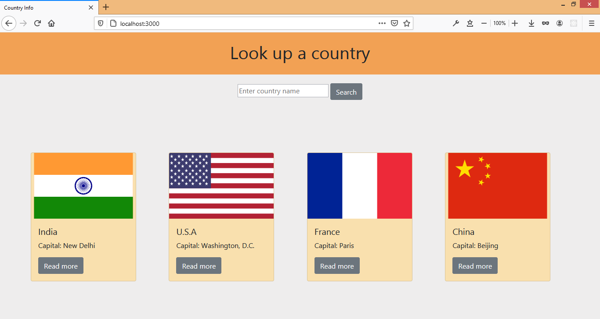
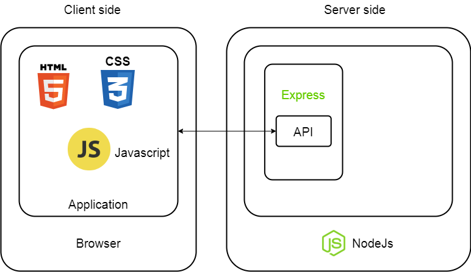

# Country Explorer App

An app to look up information about countries and current weather data of any of its cities.

---

## Getting Started

- Download and install Node.js.
- Clone this repository.
- Open terminal from project folder.
- Run npm install.
- Run node app.js.
- Go to localhost:3000 on browser.

---

## API's Used

- [Rest Countries](https://restcountries.eu/)
- [Countries Now](https://countriesnow.space/api/v0.1/countries)
- [Open weather map](https://api.openweathermap.org)

---

## Architecture and process flow diagram

